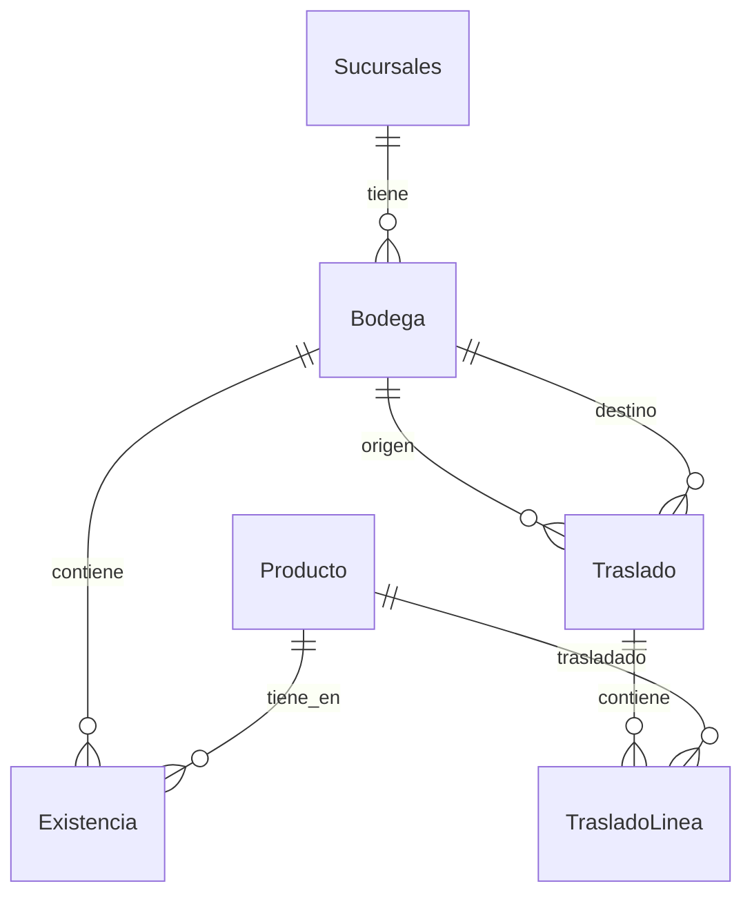
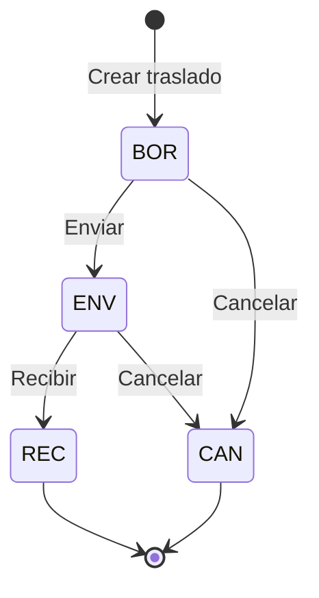
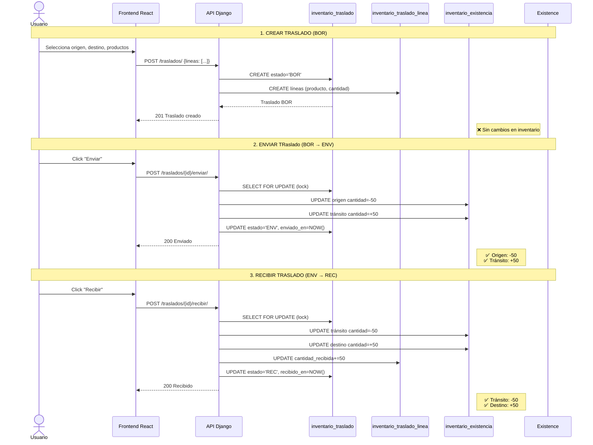

# Sistema de Gestión de Bodegas - Documentación Completa

## Índice
1. [Estructura de la Base de Datos](#estructura-de-la-base-de-datos)
2. [Modelos y Relaciones](#modelos-y-relaciones)
3. [Flujo Completo de Bodegas](#flujo-completo-de-bodegas)
4. [API Endpoints](#api-endpoints)
5. [Frontend - Componentes](#frontend-componentes)
6. [Estados del Traslado](#estados-del-traslado)

---

## Estructura de la Base de Datos

### Tabla: `main_dashboard_sucursales`
Representa cada sucursal de la tienda.

| Campo | Tipo | Descripción |
|-------|------|-------------|
| `id` | BigAutoField | PK (Primary Key) |
| `nombre` | CharField(100) | Nombre de la sucursal |
| `direccion` | CharField(255, nullable) | Dirección física |
| `ciudad` | CharField(100, nullable) | Ciudad |
| `pais` | CharField(100, nullable) | País |
| `fecha_creacion` | DateTimeField | Fecha de creación |
| `estatus` | BooleanField | Estado activo/inactivo |

---

### Tabla: `inventario_bodega`
Representa las bodegas de cada sucursal.

| Campo | Tipo | Descripción |
|-------|------|-------------|
| `id` | BigAutoField | PK |
| `sucursal_id` | ForeignKey | FK → `main_dashboard_sucursales.id` |
| `nombre` | CharField(100) | Nombre de la bodega |
| `codigo` | CharField(20, nullable) | Código único por sucursal |
| `tipo` | CharField(4) | Tipo: `ALM`, `SUC`, `TRN`, `CON`, `3PL` |
| `direccion` | CharField(255, nullable) | Dirección específica |
| `es_predeterminada` | BooleanField | ¿Es la bodega principal? |
| `estatus` | BooleanField | Estado activo/inactivo |
| `responsable_id` | ForeignKey | FK → Usuario (nullable) |
| `notas` | TextField(nullable) | Notas adicionales |
| `fecha_creacion` | DateTimeField | Fecha de creación |
| `fecha_actualizacion` | DateTimeField | Fecha de actualización |

**Tipos de Bodega:**
- `ALM`: Almacén central
- `SUC`: Bodega de sucursal
- `TRN`: En tránsito
- `CON`: Consignación
- `3PL`: Operador logístico

**Restricciones:**
- `uniq_bodega_nombre_por_sucursal`: Nombre único por sucursal
- `uniq_bodega_codigo_por_sucursal`: Código único por sucursal

---

### Tabla: `productos`
Catálogo de productos de la tienda.

| Campo | Tipo | Descripción |
|-------|------|-------------|
| `id` | BigAutoField | PK |
| `nombre` | CharField(255) | Nombre del producto |
| `descripcion` | TextField(nullable) | Descripción |
| `precio` | DecimalField(10,2) | Precio base |
| `stock` | IntegerField | **Campo cache** - Suma total de stock |
| `sku` | CharField(50) | SKU único |
| `codigo_barras` | CharField(50, nullable) | Código de barras |
| `imagen_producto` | CharField(255, nullable) | URL de imagen |
| `atributo` | CharField(50, nullable) | Atributo adicional |
| `valor_atributo` | CharField(50, nullable) | Valor del atributo |
| `sucursal_id` | ForeignKey | FK → Sucursal (nullable) |
| `id_categoria` | ForeignKey | FK → Categoría |
| `id_marca` | ForeignKey | FK → Marca |
| `id_iva` | ForeignKey | FK → IVA |
| `creado_en` | DateTimeField | Fecha de creación |

> **Nota:** El campo `stock` en `productos` es un **cache** que suma `(cantidad - reservado)` de todas las existencias en todas las bodegas.

---

### Tabla: `inventario_existencia`
Registra el stock de cada producto en cada bodega.

| Campo | Tipo | Descripción |
|-------|------|-------------|
| `id` | BigAutoField | PK |
| `producto_id` | ForeignKey | FK → `productos.id` |
| `bodega_id` | ForeignKey | FK → `inventario_bodega.id` |
| `cantidad` | IntegerField | Stock disponible |
| `reservado` | IntegerField | Stock comprometido (default: 0) |
| `minimo` | IntegerField | Stock mínimo (default: 0) |
| `maximo` | IntegerField(nullable) | Stock máximo |
| `creado_en` | DateTimeField | Fecha de creación |
| `actualizado_en` | DateTimeField | Fecha de actualización |

**Restricciones:**
- `uniq_existencia_producto_bodega`: Un único registro por (producto, bodega)
- Índices en `bodega_id` y `producto_id`

**Stock Real Disponible:** `cantidad - reservado`

---

### Tabla: `inventario_traslado`
Registra los traslados entre bodegas.

| Campo | Tipo | Descripción |
|-------|------|-------------|
| `id` | BigAutoField | PK |
| `bodega_origen_id` | ForeignKey | FK → `inventario_bodega.id` |
| `bodega_destino_id` | ForeignKey | FK → `inventario_bodega.id` |
| `estado` | CharField(3) | Estado: `BOR`, `ENV`, `REC`, `CAN` |
| `usar_bodega_transito` | BooleanField | ¿Usar bodega TRN? |
| `observaciones` | TextField(nullable) | Notas del traslado |
| `enviado_en` | DateTimeField(nullable) | Fecha de envío |
| `recibido_en` | DateTimeField(nullable) | Fecha de recepción |
| `creado_por_id` | ForeignKey | FK → Usuario (nullable) |
| `creado_en` | DateTimeField | Fecha de creación |
| `actualizado_en` | DateTimeField | Fecha de actualización |

---

### Tabla: `inventario_traslado_linea`
Líneas de detalle de cada traslado.

| Campo | Tipo | Descripción |
|-------|------|-------------|
| `id` | BigAutoField | PK |
| `traslado_id` | ForeignKey | FK → `inventario_traslado.id` |
| `producto_id` | ForeignKey | FK → `productos.id` |
| `cantidad` | IntegerField | Cantidad enviada |
| `cantidad_recibida` | IntegerField | Cantidad recibida (default: 0) |

**Restricciones:**
- `uniq_linea_por_producto_en_traslado`: Un único producto por traslado

---

## Modelos y Relaciones



### Relaciones Principales

1. **Sucursales ↔ Bodegas** (1:N)
   - Una sucursal tiene muchas bodegas
   - Cada bodega pertenece a una sucursal

2. **Bodegas ↔ Existencias** (1:N)
   - Una bodega tiene muchas existencias
   - Cada existencia pertenece a una bodega

3. **Productos ↔ Existencias** (1:N)
   - Un producto tiene existencias en múltiples bodegas
   - Cada existencia es de un producto en una bodega

4. **Traslados ↔ TrasladoLineas** (1:N)
   - Un traslado tiene muchas líneas
   - Cada línea pertenece a un traslado

---

## Flujo Completo de Bodegas

### 1. Creación de Bodegas

**Endpoint:** `POST /api/main_dashboard/bodegas/`

**Cuerpo de la petición:**
```json
{
  "sucursal": 1,
  "nombre": "Bodega Principal Norte",
  "codigo": "BOD-NOR-01",
  "tipo": "SUC",
  "direccion": "Calle 123 # 45-67",
  "es_predeterminada": true,
  "estatus": true,
  "responsable": 5,
  "notas": "Bodega principal de la sucursal norte"
}
```

**Validaciones:**
- El nombre debe ser único por sucursal
- El código debe ser único por sucursal
- Solo una bodega puede ser `es_predeterminada: true` por sucursal
- Tipo debe ser uno de: `ALM`, `SUC`, `TRN`, `CON`, `3PL`

---

### 2. Ajuste de Existencias

**Endpoint:** `POST /api/main_dashboard/existencias/ajustar/`

**Cuerpo de la petición:**
```json
{
  "producto": 10,
  "bodega": 5,
  "delta": 50
}
```

**Comportamiento:**
- `delta > 0`: Incrementa el stock
- `delta < 0`: Decrementa el stock (verifica disponibilidad)
- Crea o actualiza el registro en `inventario_existencia`
- Actualiza el cache `Producto.stock`

**Lógica de ajuste:**
```python
def ajustar_stock(producto_id, bodega_id, delta):
    with transaction.atomic():
        # Obtener o crear existencia
        existencia = Existencia.objects.get_or_create(
            producto_id=producto_id,
            bodega_id=bodega_id
        )

        # Verificar stock suficiente si delta es negativo
        if delta < 0 and existencia.cantidad < abs(delta):
            raise ValidationError("Stock insuficiente")

        # Actualizar cantidad
        existencia.cantidad += delta
        existencia.save()

        # Actualizar cache en Producto
        recalcular_stock_producto(producto_id)
```

---

### 3. Traslado de Productos

El traslado tiene **3 estados principales** que determinan su flujo:

#### Estado 1: BOR (Borrador)

**Endpoint:** `POST /api/main_dashboard/traslados/`

**Cuerpo de la petición:**
```json
{
  "bodega_origen": 5,
  "bodega_destino": 8,
  "usar_bodega_transito": true,
  "observaciones": "Reposición semanal",
  "lineas": [
    {
      "producto": 10,
      "cantidad": 50
    },
    {
      "producto": 15,
      "cantidad": 30
    }
  ]
}
```

**Comportamiento:**
- Crea el registro en `inventario_traslado` con estado `BOR`
- Crea las líneas en `inventario_traslado_linea`
- **NO afecta el inventario** - Es solo un borrador

---

#### Estado 2: ENV (Enviado)

**Endpoint:** `POST /api/main_dashboard/traslados/{id}/enviar/`

**Comportamiento cuando `usar_bodega_transito = true`:**
```python
def enviar_traslado(traslado_id):
    with transaction.atomic():
        traslado = Traslado.objects.get(id=traslado_id)

        # Validar stock disponible en origen
        for linea in traslado.lineas.all():
            stock_origen = obtener_stock(linea.producto, traslado.bodega_origen)
            if stock_origen < linea.cantidad:
                raise ValidationError(f"Stock insuficiente para {linea.producto.nombre}")

        # Restar de bodega origen
        for linea in traslado.lineas.all():
            Existencia.objects.filter(
                producto=linea.producto,
                bodega=traslado.bodega_origen
            ).update(cantidad=F('cantidad') - linea.cantidad)

        # Si usa bodega en tránsito, crear bodega TRN si no existe
        if traslado.usar_bodega_transito:
            bodega_transito = obtener_bodega_transito(traslado.bodega_origen.sucursal)

            # Sumar a bodega en tránsito
            for linea in traslado.lineas.all():
                Existencia.objects.filter(
                    producto=linea.producto,
                    bodega=bodega_transito
                ).update(cantidad=F('cantidad') + linea.cantidad)

        # Actualizar estado y fechas
        traslado.estado = 'ENV'
        traslado.enviado_en = timezone.now()
        traslado.save()

        # Recalcular stock cache
        for linea in traslado.lineas.all():
            recalcular_stock_producto(linea.producto.id)
```

**Cambios en inventario:**
- **Bodega Origen:** Stock disminuye
- **Bodega Tránsito (si aplica):** Stock aumenta temporalmente
- **Bodega Destino:** Sin cambios aún

**Comportamiento cuando `usar_bodega_transito = false`:**
- Los productos van directamente a la bodega destino
- Stock origen disminuye
- Stock destino aumenta inmediatamente
- Estado pasa directamente a `REC` (Recibido)

---

#### Estado 3: REC (Recibido)

**Endpoint:** `POST /api/main_dashboard/traslados/{id}/recibir/`

**Cuerpo de la petición (opcional - para recepción parcial):**
```json
{
  "cantidades": [
    {
      "producto": 10,
      "cantidad": 45  // Recibió 45 de 50
    },
    {
      "producto": 15,
      "cantidad": 30  // Recibió 30 de 30
    }
  ]
}
```

**Comportamiento:**
```python
def recibir_traslado(traslado_id, cantidades=None):
    with transaction.atomic():
        traslado = Traslado.objects.get(id=traslado_id)

        if traslado.estado != 'ENV':
            raise ValidationError("Solo se pueden recibir traslados enviados")

        # Restar de bodega en tránsito (si aplica)
        if traslado.usar_bodega_transito:
            bodega_transito = obtener_bodega_transito(traslado.bodega_origen.sucursal)

            for linea in traslado.lineas.all():
                cantidad_recibir = cantidades.get(linea.producto.id) or linea.cantidad

                # Actualizar línea
                linea.cantidad_recibida += cantidad_recibir
                linea.save()

                # Restar de tránsito
                Existencia.objects.filter(
                    producto=linea.producto,
                    bodega=bodega_transito
                ).update(cantidad=F('cantidad') - cantidad_recibir)

                # Sumar a bodega destino
                Existencia.objects.filter(
                    producto=linea.producto,
                    bodega=traslado.bodega_destino
                ).update(cantidad=F('cantidad') + cantidad_recibir)
        else:
            # Si no usa tránsito, ya está en destino
            # Solo actualizar cantidades recibidas
            for linea in traslado.lineas.all():
                cantidad_recibir = cantidades.get(linea.producto.id) or linea.cantidad
                linea.cantidad_recibida += cantidad_recibir
                linea.save()

        # Verificar si todo fue recibido
        if all(l.cantidad_recibida >= l.cantidad for l in traslado.lineas.all()):
            traslado.estado = 'REC'
            traslado.recibido_en = timezone.now()

        traslado.save()

        # Recalcular stock cache
        for linea in traslado.lineas.all():
            recalcular_stock_producto(linea.producto.id)
```

**Cambios en inventario:**
- **Bodega Tránsito (si aplica):** Stock disminuye
- **Bodega Destino:** Stock aumenta
- **Bodega Origen:** Sin cambios (ya se descontó al enviar)

---

### 4. Cancelación de Traslado

**Endpoint:** `POST /api/main_dashboard/traslados/{id}/cancelar/`

**Comportamiento según estado:**

| Estado Actual | Acción |
|--------------|--------|
| `BOR` | Solo marca como cancelado, no afecta inventario |
| `ENV` | Revierte todos los movimientos de stock (devuelve a origen, quita de tránsito) |
| `REC` | **No permitido** - Usar devolución |
| `CAN` | No hace nada (ya cancelado) |

```python
def cancelar_traslado(traslado_id):
    with transaction.atomic():
        traslado = Traslado.objects.get(id=traslado_id)

        if traslado.estado == 'REC':
            raise ValidationError("No se puede cancelar un traslado recibido")

        if traslado.estado == 'ENV':
            # Revertir movimientos
            # Devolver a bodega origen
            for linea in traslado.lineas.all():
                Existencia.objects.filter(
                    producto=linea.producto,
                    bodega=traslado.bodega_origen
                ).update(cantidad=F('cantidad') + linea.cantidad)

            # Quitar de bodega tránsito (si aplica)
            if traslado.usar_bodega_transito:
                bodega_transito = obtener_bodega_transito(traslado.bodega_origen.sucursal)

                for linea in traslado.lineas.all():
                    Existencia.objects.filter(
                        producto=linea.producto,
                        bodega=bodega_transito
                    ).update(cantidad=F('cantidad') - linea.cantidad)

        # Marcar como cancelado
        traslado.estado = 'CAN'
        traslado.save()

        # Recalcular stock cache
        for linea in traslado.lineas.all():
            recalcular_stock_producto(linea.producto.id)
```

---

## API Endpoints

### Bodegas

| Método | Endpoint | Descripción |
|--------|----------|-------------|
| GET | `/api/main_dashboard/bodegas/` | Listar todas las bodegas |
| POST | `/api/main_dashboard/bodegas/` | Crear nueva bodega |
| GET | `/api/main_dashboard/bodegas/{id}/` | Obtener bodega por ID |
| PUT | `/api/main_dashboard/bodegas/{id}/` | Actualizar bodega completa |
| PATCH | `/api/main_dashboard/bodegas/{id}/` | Actualización parcial |
| DELETE | `/api/main_dashboard/bodegas/{id}/` | Eliminar bodega |

### Existencias

| Método | Endpoint | Descripción |
|--------|----------|-------------|
| GET | `/api/main_dashboard/existencias/` | Listar existencias |
| POST | `/api/main_dashboard/existencias/` | Crear existencia |
| GET | `/api/main_dashboard/existencias/{id}/` | Obtener existencia |
| PUT | `/api/main_dashboard/existencias/{id}/` | Actualizar existencia |
| PATCH | `/api/main_dashboard/existencias/{id}/` | Actualización parcial |
| DELETE | `/api/main_dashboard/existencias/{id}/` | Eliminar existencia |
| POST | `/api/main_dashboard/existencias/ajustar/` | **Ajustar stock** |

### Traslados

| Método | Endpoint | Descripción |
|--------|----------|-------------|
| GET | `/api/main_dashboard/traslados/` | Listar traslados |
| POST | `/api/main_dashboard/traslados/` | **Crear traslado (BOR)** |
| GET | `/api/main_dashboard/traslados/{id}/` | Obtener traslado |
| PUT | `/api/main_dashboard/traslados/{id}/` | Actualizar traslado |
| PATCH | `/api/main_dashboard/traslados/{id}/` | Actualización parcial |
| DELETE | `/api/main_dashboard/traslados/{id}/` | Eliminar traslado |
| POST | `/api/main_dashboard/traslados/{id}/enviar/` | **Enviar traslado (ENV)** |
| POST | `/api/main_dashboard/traslados/{id}/recibir/` | **Recibir traslado (REC)** |
| POST | `/api/main_dashboard/traslados/{id}/cancelar/` | **Cancelar traslado (CAN)** |

---

## Frontend - Componentes

### Archivo: `frontend/src/components/bodegas/BodegasModal.jsx`

**Secciones disponibles:**
1. **Crear Bodega** (`crear-bodega`)
   - Formulario para crear nuevas bodegas
   - Campos: nombre, código, tipo, dirección, responsable

2. **Administrar** (`administrar`)
   - Vista de administración de bodegas
   - Lista de bodegas con acciones

3. **Ajustar Existencia** (`ajustar-existencia`)
   - Formulario para ajustar stock manualmente
   - Producto, bodega, delta (+/-)

4. **Realizar Traslado** (`realizar-traslado`)
   - Crear nuevo traslado (estado BOR)
   - Seleccionar origen, destino, productos y cantidades
   - Opción para usar bodega en tránsito

5. **Enviar Traslado** (`enviar-traslado`)
   - Enviar traslado a estado ENV
   - Lista de traslados en borrador
   - Validación de stock antes de enviar

6. **Recibir Traslado** (`recibir-traslado`)
   - Recibir traslado a estado REC
   - Lista de traslados enviados
   - Soporte para recepción parcial
   - Selección múltiple de traslados

### Servicios API

**Archivo:** `frontend/src/services/api.js`

```javascript
// Bodegas
export const fetchBodegas = ({ tokenUsuario, usuario, subdominio }) => { ... }

// Existencias
export const obtenerExistenciasPorBodega = ({ usuario, token, subdominio, bodega_id }) => { ... }

// Traslados
export const enviarTraslado = ({ token, usuario, subdominio, traslado_id }) => { ... }
export const recibirTraslado = ({ usuario, token, subdominio, traslado_id, cantidades }) => { ... }
export const listarTrasladosPorBodegaDestino = ({ token, usuario, subdominio, bodega_destino_id, estado }) => { ... }
```

---

## Estados del Traslado

### Diagrama de Estados



### Descripción de Estados

| Estado | Código | Descripción | Afecta Inventario |
|--------|--------|-------------|-------------------|
| Borrador | `BOR` | Traslado creado pero no enviado | ❌ No |
| Enviado | `ENV` | Productos en tránsito o enviados | ✅ Sí |
| Recibido | `REC` | Traslado completado | ✅ Sí |
| Cancelado | `CAN` | Traslado anulado | Revierte cambios |

### Transiciones Permitidas

| Desde | Hasta | ¿Permitido? | Notas |
|-------|-------|------------|-------|
| BOR | ENV | ✅ | Valida stock antes |
| BOR | CAN | ✅ | Solo marca como cancelado |
| ENV | REC | ✅ | Proceso de recepción |
| ENV | CAN | ✅ | Revierte movimientos |
| REC | CAN | ❌ | Usar devolución |
| CAN | * | ❌ | Estado final |

---

## Ejemplo Completo de Traslado

### Escenario: Traslado con bodega en tránsito

**1. Estado Inicial:**
- Producto: "iPhone 15" (ID: 10)
- Bodega Origen: "Bodega Centro" (ID: 5) - **100 unidades**
- Bodega Destino: "Bodega Norte" (ID: 8) - **0 unidades**
- Bodega Tránsito: "Tránsito Centro" (ID: 15) - **0 unidades**

**2. Crear Traslado (BOR):**
```bash
POST /api/main_dashboard/traslados/
{
  "bodega_origen": 5,
  "bodega_destino": 8,
  "usar_bodega_transito": true,
  "lineas": [{"producto": 10, "cantidad": 50}]
}
```
- Traslado ID: 100
- Estado: BOR
- **Sin cambios en inventario**

**3. Enviar Traslado (ENV):**
```bash
POST /api/main_dashboard/traslados/100/enviar/
```
- Estado: ENV
- **Bodega Origen (5):** 100 → **50 unidades** (-50)
- **Bodega Tránsito (15):** 0 → **50 unidades** (+50)
- **Bodega Destino (8):** 0 unidades (sin cambios)

**4. Recibir Traslado (REC):**
```bash
POST /api/main_dashboard/traslados/100/recibir/
{
  "cantidades": [{"producto": 10, "cantidad": 50}]
}
```
- Estado: REC
- **Bodega Tránsito (15):** 50 → **0 unidades** (-50)
- **Bodega Destino (8):** 0 → **50 unidades** (+50)
- **Bodega Origen (5):** 50 unidades (sin cambios)

**Resultado Final:**
- Origen: 50 unidades
- Destino: 50 unidades
- Tránsito: 0 unidades

---

# 🔍 ANÁLISIS DETALLADO DEL FLUJO DE TRASLADOS

## Resumen Ejecutivo

El sistema de traslados permite mover productos entre bodegas siguiendo un flujo de estados controlado que garantiza la consistencia del inventario. El proceso involucra **2 tablas principales** y **3 estados** del traslado.

## Tablas Utilizadas en Traslados

### 1. `inventario_traslado`
**Propósito:** Cabecera del traslado (información general)

| Campo | Uso en el flujo |
|-------|----------------|
| `id` | Identificador único del traslado |
| `bodega_origen_id` | Bodega de donde salen los productos |
| `bodega_destino_id` | Bodega a donde llegan los productos |
| `estado` | Controla el flujo: BOR → ENV → REC |
| `usar_bodega_transito` | ¿Usa bodega intermedia durante el transporte? |
| `enviado_en` | Timestamp cuando pasa a ENV |
| `recibido_en` | Timestamp cuando pasa a REC |

### 2. `inventario_traslado_linea`
**Propósito:** Detalle de productos del traslado

| Campo | Uso en el flujo |
|-------|----------------|
| `traslado_id` | FK al traslado padre |
| `producto_id` | Producto a trasladar |
| `cantidad` | Cantidad enviada (fija) |
| `cantidad_recibida` | Cantidad recibida (incremental) |

**Propiedad calculada:** `pendiente_por_recibir = cantidad - cantidad_recibida`

### 3. `inventario_existencia` (se modifica durante el flujo)
**Propósito:** Registro real del stock en cada bodega

| Campo | Modificado por | Cuándo |
|-------|----------------|-------|
| `cantidad` | ENV, REC, CAN | Al enviar, recibir o cancelar |
| `bodega_id` | - | Define qué bodega gana/pierde stock |

---

## Flujo Completo: Código Backend

### 🔵 PASO 1: Crear Traslado (BOR)

**Archivo:** [backend/main_dashboard/views.py:1973](backend/main_dashboard/views.py#L1973)
**Endpoint:** `POST /api/main_dashboard/traslados/`
**ViewSet:** `TrasladoViewSet.create()` → `TrasladoSerializer.create()`

```python
# backend/main_dashboard/serializers.py:451
def create(self, validated_data):
    alias = self.context.get('db_alias') or 'default'
    lineas = validated_data.pop('lineas', [])

    # 1. Crear cabecera del traslado
    t = Traslado.objects.using(alias).create(**validated_data)

    # 2. Crear líneas de productos
    for ln in lineas:
        TrasladoLinea.objects.using(alias).create(traslado=t, **ln)

    # 3. Retorna traslado en estado BOR (sin afectar inventario)
    return t
```

**Payload de ejemplo:**
```json
{
  "bodega_origen": 5,
  "bodega_destino": 8,
  "usar_bodega_transito": true,
  "observaciones": "Reposición semanal",
  "lineas": [
    {"producto": 10, "cantidad": 50},
    {"producto": 15, "cantidad": 30}
  ]
}
```

**Frontend:** [RealizarTraslado.jsx:380](frontend/src/components/bodegas/sections/RealizarTraslado.jsx#L380)
- Usuario selecciona origen/destino
- Agrega líneas de productos con cantidades
- Marca casilla "usar bodega tránsito" si aplica

**⚠️ IMPORTANTE:** En estado BOR, **NO se modifica el inventario**. Es solo un borrador.

---

### 🟠 PASO 2: Enviar Traslado (BOR → ENV)

**Archivo:** [backend/main_dashboard/views.py:1695](backend/main_dashboard/views.py#L1695)
**Endpoint:** `POST /api/main_dashboard/traslados/{id}/enviar/`
**Función:** `enviar_traslado_alias(alias, traslado_id)`

```python
def enviar_traslado_alias(alias: str, traslado_id: int) -> Traslado:
    with transaction.atomic(using=alias):
        # 1. BLOQUEAR traslado para evitar concurrencia
        t = (Traslado.objects.using(alias)
             .select_for_update()  # 🔒 LOCK
             .select_related('bodega_origen', 'bodega_destino')
             .prefetch_related('lineas')
             .get(pk=traslado_id))

        # 2. VALIDAR estado
        if t.estado != 'BOR':
            raise ValueError('Solo se puede ENVIAR un traslado en estado BORRADOR.')

        if not t.lineas.exists():
            raise ValueError('El traslado no tiene líneas.')

        # 3. OBTENER bodega tránsito (si aplica)
        bodega_trn = _get_bodega_transito_para_alias(alias, t.bodega_origen) \
                    if t.usar_bodega_transito else None

        # 4. AJUSTAR stock en cada línea
        for ln in t.lineas.select_for_update():
            # Restar de origen
            ajustar_stock_alias(alias, ln.producto_id, t.bodega_origen_id, -int(ln.cantidad))

            # Sumar a tránsito (si usa)
            if bodega_trn:
                ajustar_stock_alias(alias, ln.producto_id, bodega_trn.id, +int(ln.cantidad))

        # 5. ACTUALIZAR estado y timestamps
        t.estado = 'ENV'
        t.enviado_en = timezone.now()
        t.save(using=alias)

        return t
```

**Función auxiliar `ajustar_stock_alias`:**
```python
def ajustar_stock_alias(alias: str, producto_id: int, bodega_id: int, delta: int):
    """Ajusta inventario_existencia.cantidad"""
    with transaction.atomic(using=alias):
        # Obtener o crear existencia
        existencia, _ = (Existencia.objects.using(alias)
                        .select_for_update()
                        .get_or_create(
                            producto_id=producto_id,
                            bodega_id=bodega_id,
                            defaults={'cantidad': 0, 'reservado': 0}
                        ))

        # Validar stock suficiente si delta es negativo
        if delta < 0 and existencia.cantidad < abs(delta):
            raise ValueError(f"Stock insuficiente. Disponible: {existencia.cantidad}, Requerido: {abs(delta)}")

        # Actualizar cantidad
        existencia.cantidad += delta
        existencia.save(using=alias)
```

**Cambios en `inventario_existencia`:**

| Escenario | Bodega Origen | Bodega Tránsito | Bodega Destino |
|-----------|---------------|-----------------|----------------|
| `usar_bodega_transito = true` | ⬇️ **-cantidad** | ⬆️ **+cantidad** | Sin cambios |
| `usar_bodega_transito = false` | ⬇️ **-cantidad** | N/A | ⬆️ **+cantidad** (pasa a REC directamente) |

**Frontend:** [EnviarTraslado.jsx:144](frontend/src/components/bodegas/sections/EnviarTraslado.jsx#L144)
- Lista traslados en estado BOR
- Filtra por "solo mis traslados" (creado_por_id = usuario actual)
- Botón "Enviar" llama al endpoint

---

### 🟢 PASO 3: Recibir Traslado (ENV → REC)

**Archivo:** [backend/main_dashboard/views.py:1720](backend/main_dashboard/views.py#L1720)
**Endpoint:** `POST /api/main_dashboard/traslados/{id}/recibir/`
**Función:** `recibir_traslado_alias(alias, traslado_id, cantidades_map)`

```python
def recibir_traslado_alias(alias: str, traslado_id: int, cantidades_map: dict | None) -> Traslado:
    with transaction.atomic(using=alias):
        # 1. BLOQUEAR traslado y líneas
        t = (Traslado.objects.using(alias)
             .select_for_update()  # 🔒 LOCK
             .select_related('bodega_origen', 'bodega_destino')
             .prefetch_related('lineas')
             .get(pk=traslado_id))

        # 2. VALIDAR estado
        if t.estado != 'ENV':
            raise ValueError('Solo se puede RECIBIR un traslado ENVIADO.')

        # 3. OBTENER bodega tránsito (si aplica)
        bodega_trn = _get_bodega_transito_para_alias(alias, t.bodega_origen) \
                    if t.usar_bodega_transito else None

        # 4. PROCESAR cada línea
        for ln in t.lineas.select_for_update():
            # Calcular pendiente
            pendiente = max(0, int(ln.cantidad) - int(ln.cantidad_recibida))

            if pendiente == 0:
                continue  # Ya recibido completamente

            # Obtener cantidad a recibir (del map o pendiente total)
            qty = cantidades_map.get(ln.producto_id, pendiente) if cantidades_map else pendiente
            qty = int(qty)

            # Validar rango
            if qty <= 0 or qty > pendiente:
                raise ValueError(f'Cantidad inválida para producto {ln.producto_id}.')

            # Restar de tránsito (si usa)
            if bodega_trn:
                ajustar_stock_alias(alias, ln.producto_id, bodega_trn.id, -qty)

            # Sumar a destino
            ajustar_stock_alias(alias, ln.producto_id, t.bodega_destino_id, +qty)

            # Actualizar cantidad_recibida en línea
            ln.cantidad_recibida = int(ln.cantidad_recibida) + qty
            ln.save(using=alias)

        # 5. VERIFICAR si todo fue recibido
        if all(int(l.cantidad_recibida) >= int(l.cantidad) for l in t.lineas.all()):
            t.estado = 'REC'
            t.recibido_en = timezone.now()

        t.save(using=alias)
        return t
```

**Payload para recepción parcial:**
```json
{
  "cantidades": [
    {"producto": 10, "cantidad": 45},  // Recibe 45 de 50 (5 pendiente)
    {"producto": 15, "cantidad": 30}   // Recibe 30 de 30 (completo)
  ]
}
```

**Si `cantidades` es `null`:** Recibe TODO el pendiente automáticamente

**Cambios en `inventario_existencia`:**

| Escenario | Bodega Tránsito | Bodega Destino | Estado final |
|-----------|-----------------|----------------|--------------|
| Recepción completa (`cantidad_recibida >= cantidad`) | ⬇️ **-qty** | ⬆️ **+qty** | `REC` |
| Recepción parcial (`cantidad_recibida < cantidad`) | ⬇️ **-qty** | ⬆️ **+qty** | `ENV` (pendiente) |

**Frontend:** [RecibirTraslado.jsx:18](frontend/src/components/bodegas/sections/RecibirTraslado.jsx#L18)
- Lista traslados en estado ENV para la bodega destino del usuario
- Soporta selección múltiple de traslados
- Muestra `pendiente_por_recibir` por línea
- Envía `cantidades` solo si es recepción parcial

---

### 🔴 PASO 4: Cancelar Traslado (BOR/ENV → CAN)

**Archivo:** [backend/main_dashboard/views.py:1753](backend/main_dashboard/views.py#L1753)
**Endpoint:** `POST /api/main_dashboard/traslados/{id}/cancelar/`
**Función:** `cancelar_traslado_alias(alias, traslado_id)`

```python
def cancelar_traslado_alias(alias: str, traslado_id: int) -> Traslado:
    with transaction.atomic(using=alias):
        # 1. BLOQUEAR traslado
        t = (Traslado.objects.using(alias)
             .select_for_update()
             .select_related('bodega_origen', 'bodega_destino')
             .prefetch_related('lineas')
             .get(pk=traslado_id))

        # 2. VALIDAR estado
        if t.estado == 'REC':
            raise ValueError('No se puede cancelar un traslado ya recibido.')

        if t.estado == 'CAN':
            return t  # Ya cancelado

        # 3. REVERTIR movimientos si estaba en ENV
        if t.estado == 'ENV':
            bodega_trn = _get_bodega_transito_para_alias(alias, t.bodega_origen) \
                        if t.usar_bodega_transito else None

            for ln in t.lineas.select_for_update():
                # Calcular cantidad pendiente (no recibida)
                qty_pend = max(0, int(ln.cantidad) - int(ln.cantidad_recibida))

                if qty_pend <= 0:
                    continue  # Ya recibido todo

                # Devolver a origen
                ajustar_stock_alias(alias, ln.producto_id, t.bodega_origen_id, +qty_pend)

                # Quitar de tránsito (si usa)
                if bodega_trn:
                    ajustar_stock_alias(alias, ln.producto_id, bodega_trn.id, -qty_pend)

        # 4. MARCAR como cancelado
        t.estado = 'CAN'
        t.save(using=alias)

        return t
```

**Comportamiento según estado:**

| Estado actual | Acción | ¿Revierte inventario? |
|--------------|--------|----------------------|
| `BOR` | Solo marca como CAN | ❌ No (nunca afectó inventario) |
| `ENV` | Revierte movimientos | ✅ Sí (devuelve a origen, quita de tránsito) |
| `REC` | ❌ ERROR | - (Usar devolución en su lugar) |
| `CAN` | No hace nada | - (Ya cancelado) |

---

## Funciones Auxiliares Clave

### `_get_bodega_transito_para_alias()`

**Propósito:** Busca o crea la bodega de tránsito para una sucursal

```python
def _get_bodega_transito_para_alias(alias: str, bodega_origen: Bodega) -> Bodega:
    """
    Busca una bodega tipo='TRN' en la misma sucursal que bodega_origen.
    Si no existe, la crea automáticamente.
    """
    sucursal = bodega_origen.sucursal

    # Buscar bodega TRN existente
    bodega_trn = (Bodega.objects.using(alias)
                  .filter(sucursal=sucursal, tipo='TRN')
                  .first())

    if not bodega_trn:
        # Crear bodega de tránsito automáticamente
        bodega_trn = Bodega.objects.using(alias).create(
            sucursal=sucursal,
            nombre=f'Tránsito {sucursal.nombre}',
            codigo=f'TRN-{sucursal.id}',
            tipo='TRN',
            estatus=True
        )

    return bodega_trn
```

---

## Diagrama de Secuencia Completo



---

## Validaciones y Reglas de Negocio

### ✅ Validaciones al ENVIAR:

1. **Estado debe ser BOR**
   ```python
   if t.estado != 'BOR':
       raise ValueError('Solo se puede ENVIAR un traslado en estado BORRADOR.')
   ```

2. **Debe tener líneas**
   ```python
   if not t.lineas.exists():
       raise ValueError('El traslado no tiene líneas.')
   ```

3. **Stock suficiente en origen** (implícito en `ajustar_stock_alias`)
   ```python
   if delta < 0 and existencia.cantidad < abs(delta):
       raise ValueError(f"Stock insuficiente. Disponible: {existencia.cantidad}")
   ```

### ✅ Validaciones al RECIBIR:

1. **Estado debe ser ENV**
   ```python
   if t.estado != 'ENV':
       raise ValueError('Solo se puede RECIBIR un traslado ENVIADO.')
   ```

2. **Cantidad debe ser válida**
   ```python
   if qty <= 0 or qty > pendiente:
       raise ValueError(f'Cantidad inválida para producto {producto_id}.')
   ```

3. **Cambio automático a REC cuando todo recibido**
   ```python
   if all(l.cantidad_recibida >= l.cantidad for l in t.lineas.all()):
       t.estado = 'REC'
   ```

### ✅ Validaciones al CANCELAR:

1. **No cancelar si ya fue recibido**
   ```python
   if t.estado == 'REC':
       raise ValueError('No se puede cancelar un traslado ya recibido.')
   ```

---

## Recepción Parcial: Caso Especial

**Escenario:** Se enviaron 50 unidades, pero solo llegaron 45 (5 perdidas/dañadas)

**Estado Inicial (ENV):**
- `cantidad`: 50
- `cantidad_recibida`: 0
- `pendiente_por_recibir`: 50

**Recepción de 45:**
```json
POST /traslados/100/recibir/
{
  "cantidades": [{"producto": 10, "cantidad": 45}]
}
```

**Estado Final (ENV - pendiente):**
- `cantidad`: 50
- `cantidad_recibida`: 45
- `pendiente_por_recibir`: 5
- `estado`: **ENV** (todavía)

**Segunda recepción de 5:**
```json
POST /traslados/100/recibir/
{
  "cantidades": [{"producto": 10, "cantidad": 5}]
}
```

**Estado Final (REC - completo):**
- `cantidad`: 50
- `cantidad_recibida`: 50
- `pendiente_por_recibir`: 0
- `estado`: **REC** (ahora sí)

---

## Relación con Frontend

### Componentes React:

1. **[RealizarTraslado.jsx](frontend/src/components/bodegas/sections/RealizarTraslado.jsx)**
   - Paso 1: Seleccionar modo (crear/recibir)
   - Paso 2: Seleccionar bodega origen/destino
   - Paso 3: Agregar líneas de productos
   - Paso 4: Checkbox "usar bodega tránsito"
   - POST → `/traslados/`

2. **[EnviarTraslado.jsx](frontend/src/components/bodegas/sections/EnviarTraslado.jsx)**
   - Lista traslados BOR
   - Filtros: "solo borradores", "solo mis traslados"
   - Botón "Enviar más reciente"
   - POST → `/traslados/{id}/enviar/`

3. **[RecibirTraslado.jsx](frontend/src/components/bodegas/sections/RecibirTraslado.jsx)**
   - Lista traslados ENV por bodega destino
   - Búsqueda por ID, bodega, producto
   - Toggle selección simple/múltiple
   - POST → `/traslados/{id}/recibir/`

### Servicios API ([frontend/src/services/api.js](frontend/src/services/api.js)):

```javascript
// Crear traslado
export const crearTraslado = async ({ tokenUsuario, usuario, subdominio, traslado }) => {
  const response = await fetch(`${API_URL}/traslados/`, {
    method: 'POST',
    headers: { 'Content-Type': 'application/json', Authorization: `Bearer ${tokenUsuario}` },
    body: JSON.stringify({ usuario, subdominio, ...traslado })
  })
  return response.json()
}

// Enviar traslado
export const enviarTraslado = async ({ tokenUsuario, usuario, subdominio, traslado_id }) => {
  const response = await fetch(`${API_URL}/traslados/${traslado_id}/enviar/`, {
    method: 'POST',
    headers: { 'Content-Type': 'application/json', Authorization: `Bearer ${tokenUsuario}` },
    body: JSON.stringify({ usuario, subdominio })
  })
  return response.json()
}

// Recibir traslado
export const recibirTraslado = async ({ tokenUsuario, usuario, subdominio, traslado_id, cantidades }) => {
  const response = await fetch(`${API_URL}/traslados/${traslado_id}/recibir/`, {
    method: 'POST',
    headers: { 'Content-Type': 'application/json', Authorization: `Bearer ${tokenUsuario}` },
    body: JSON.stringify({ usuario, subdominio, cantidades })
  })
  return response.json()
}

// Listar traslados por bodega destino
export const listarTrasladosPorBodegaDestino = async ({ tokenUsuario, usuario, subdominio, bodega_destino_id, estado }) => {
  const response = await fetch(`${API_URL}/traslados/por-destino/`, {
    method: 'POST',
    headers: { 'Content-Type': 'application/json', Authorization: `Bearer ${tokenUsuario}` },
    body: JSON.stringify({ usuario, subdominio, bodega_destino_id, estado })
  })
  return response.json()
}
```

---

## Consideraciones de Concurrencia

El sistema usa `SELECT FOR UPDATE` para bloquear registros a nivel de base de datos:

```python
# Bloquea el traslado hasta que termine la transacción
t = (Traslado.objects.using(alias)
     .select_for_update()  # 🔒 LOCK en BD
     .get(pk=traslado_id))

# Bloquea cada línea de producto
for ln in t.lineas.select_for_update():  # 🔒 LOCK por línea
    # ... lógica ...
```

**Esto previene:**
- Dos usuarios enviando el mismo traslado simultáneamente
- Dos usuarios recibiendo el mismo traslado simultáneamente
- Inconsistencia en el stock por operaciones concurrentes

---

## Seeder para Pruebas

**Comando:**
```bash
python manage.py seed_analytics_data --sucursales=3 --productos=50 --dias-historia=60
```

**Crea:**
- 3 Sucursales
- 6 Bodegas (2 por sucursal: 1 Principal, 1 Almacén)
- 50 Productos
- Existencias en bodegas aleatorias
- Ventas históricas para analytics

**Ubicación:** `backend/analytics/management/commands/seed_analytics_data.py`

---

## Consideraciones Importantes

1. **Stock Cache:** El campo `productos.stock` es un campo cache que se recalcula con cada movimiento. No debe modificarse manualmente.

2. **Bodega en Tránsito:** Es opcional pero recomendada para mantener consistencia durante el transporte físico.

3. **Recepción Parcial:** El sistema permite recibir menos cantidad de la enviada. El traslado permanece en estado `ENV` hasta que todo sea recibido.

4. **Unicidad:** No puede haber dos bodegas con el mismo nombre o código dentro de una sucursal.

5. **Transacciones:** Todas las operaciones de modificación de stock usan `transaction.atomic()` para garantizar consistencia.

6. **Multi-Tenant:** El sistema soporta múltiples tiendas (esquema), cada una con sus propias bodegas y productos.

---

## Archivos Clave en el Código

### Backend
- `backend/main_dashboard/models.py` - Modelos de Bodega, Existencia, Traslado
- `backend/main_dashboard/viewsets.py` - ViewSets de la API
- `backend/analytics/services/inventario_service.py` - Servicios de inventario
- `backend/main_dashboard/migrations/0006_*.py` - Migraciones que crean tablas de inventario

### Frontend
- `frontend/src/components/bodegas/BodegasModal.jsx` - Modal principal de gestión
- `frontend/src/components/bodegas/sections/` - Secciones individuales
- `frontend/src/services/api.js` - Cliente HTTP

### Datos de Prueba
- `backend/analytics/management/commands/seed_analytics_data.py` - Seeder

---

**Última actualización:** Febrero 2026
**Versión del sistema:** 1.0
